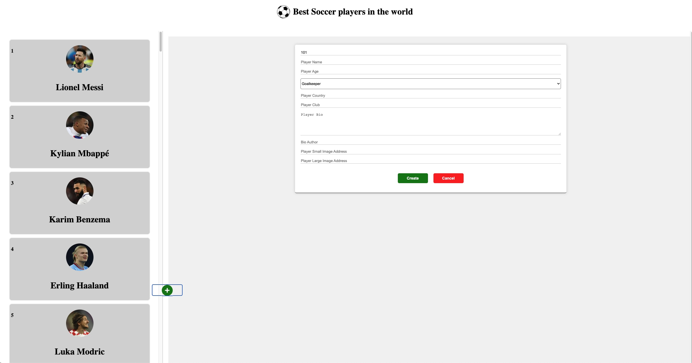
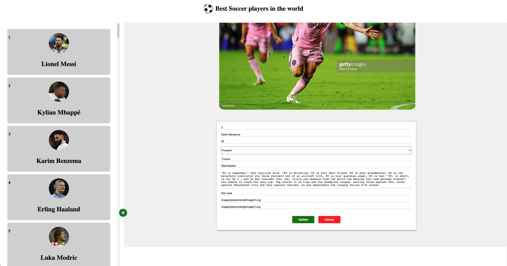
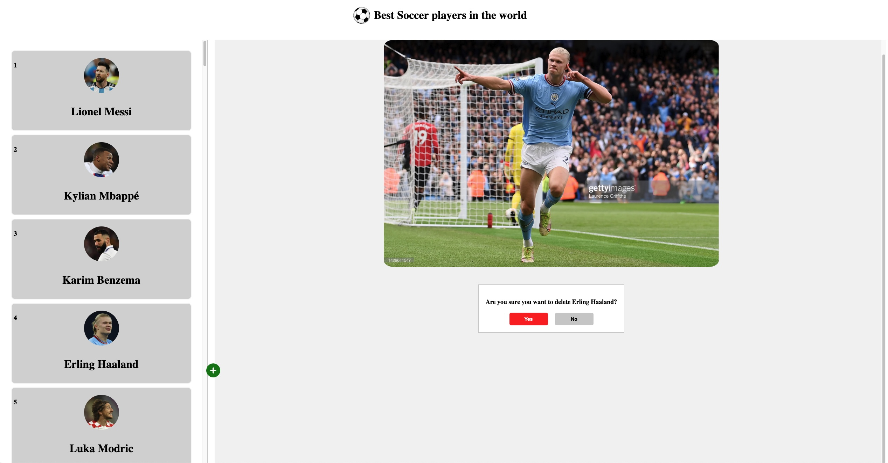

# Best Soccer Players

Welcome to the Best Soccer Players project! This web application is designed to provide information about some of the greatest soccer players in history. It offers a user-friendly interface to explore player information. You also can add a new player, edit player's info and delete the player.

You can access the live project here: [Best Soccer Players](https://soccer-players.onrender.com)

## Table of Contents

- [Screenshots](#screenshots)
- [Features](#features);
- [Getting Started](#getting-started)
  - [Installation](#installation)
  - [Usage](#usage)
- [License](#license)

<h2 id="screenshots">Screenshots</h2>

Here are some screenshots of the Best Soccer Players Website:

### Players Info

### Add a New Player

### Edit Player Info

### Delete a Player

<h2 id="features">Features</h2>

- **Player Profiles:** Access and view comprehensive player profiles containing essential information such as player name, age, position, club, national team, and more.
- **Edit Player Info:** Update and edit player details to ensure accurate and up-to-date information.
- **Add New Players:** Easily add new players to the database, including their personal information and career highlights.
- **Delete Players:** Remove players from the database when necessary, providing a streamlined way to manage player data.

<h2 id="getting-started">Getting Started</h2>

<h3 id="installation">Installation</h3>

To run the project locally, follow these steps:

1. Clone this repository: `git clone https://github.com/jandos0492/soccer-players.git`
2. Navigate to the project directory: `cd soccer-players`
3. Navigate to the backend directory: `cd backend`
4. Install backend dependencies: `npm install`
5. Start the backend development server: `npm start`

    - The backend server should now be accessible in your browser at `http://localhost:8081`
    - The database for the player will be accessible at `http://localhost:8081/api`
6. Navigate to the frontend directory: `cd ../frontend`
7. Install the frontend dependencies: `npm install`
8. Start the development server: `npm start`
    - The website should now be accessible in your browser at: `http://localhost:3000`

<h3 id="usage">Usage</h3>

The Best Soccer Players project provides an intuitive and user-friendly interface for managing soccer player profiles. Here's how to effectively use the various features:

### View Player Profiles

- On the left side of the application, you'll find a list of all the players available in the database.
- Click on a player's name to view detailed information about that player, including their name, age, position, club, country, bio and bio's author.
- Take advantage of this feature to explore the profiles of your favorite soccer players and learn more about their achievements and careers.

### Add New Player

- To add a new player to the database, locate the "+" icon, typically found near the top or bottom of the player list.
- Click the "+" icon to open a form where you can input the player's details.
- Fill in the required information, such as the player's name, age, club, country, and bio etc.
- Submit the form to add the new player to the database.
- This feature is perfect for including emerging talents or players missing from the current database.

### Edit Player Information

- For players whose information needs updating, locate the "Edit" button associated with each player's profile.
- Click the "Edit" button to open a form pre-filled with the player's existing information.
- Modify any relevant details, such as a player's age, club, country, or bio.
- After making your changes, submit the form to update the player's information in the database.
- Use this feature to keep player profiles accurate and reflective of their current status.

### Delete Player

- If a player needs to be removed from the database, look for the "Delete" button on their profile.
- Click the "Delete" button to initiate the deletion process. Confirm the action when prompted.
- This action will permanently remove the player's profile and information from the database.
- Be cautious when using this feature, as deleted data cannot be recovered.

With these user-friendly features, you can conveniently explore player profiles, add new players, edit information, and manage the database to create a comprehensive collection of soccer player profiles.

<h2 id="license">License</h2>

This project is licensed under the MIT License.